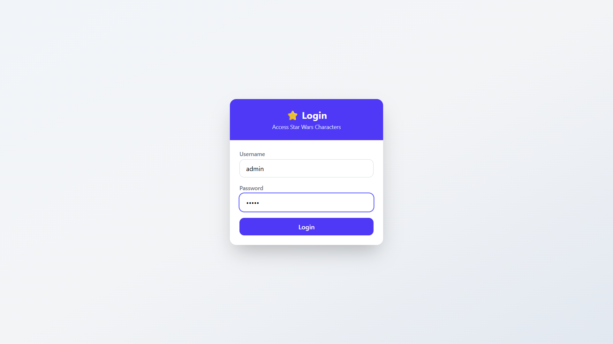
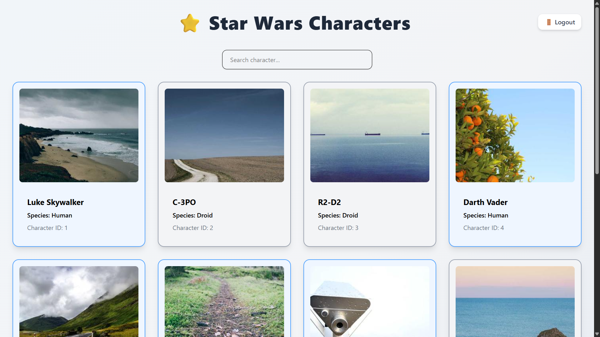
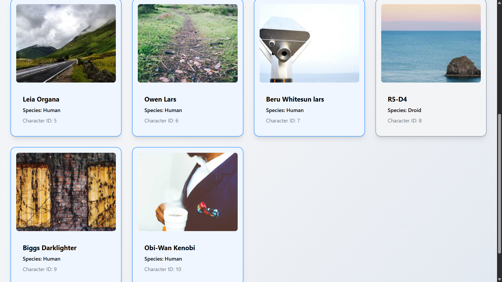
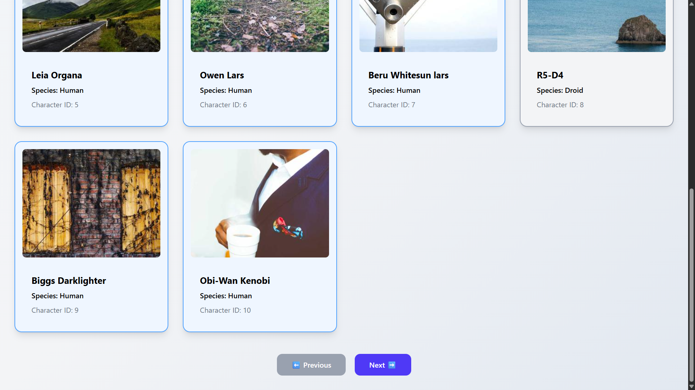
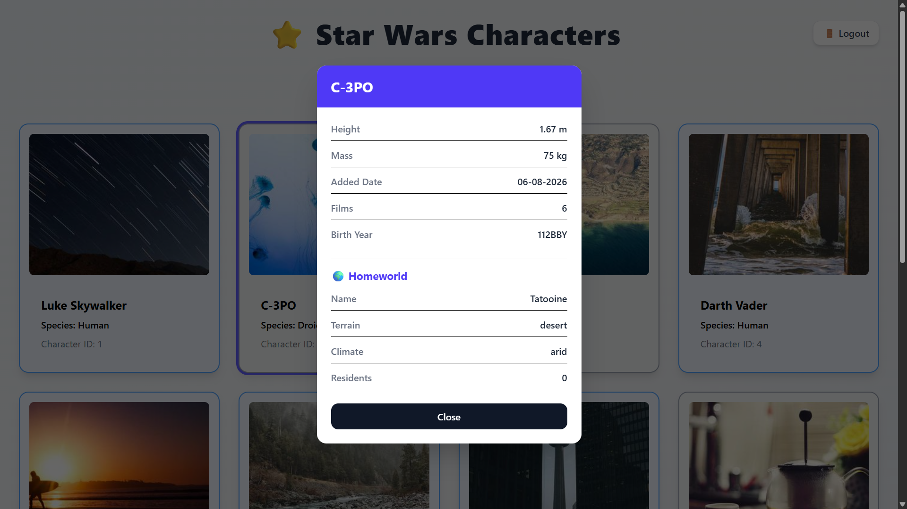
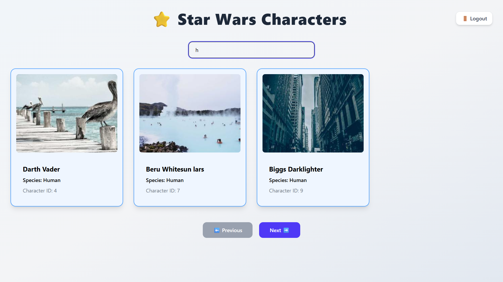

# ⭐ Star Wars Characters

A responsive React + TypeScript application built using the **SWAPI (Star Wars API)**. This project displays Star Wars characters with pagination, search functionality, species-based card colors, detailed character information inside a modal, and homeworld details.

---

## 🚀 Live Demo

> Add your Vercel deployment link here after deployment.

Example:

```
https://your-app.vercel.app
```

---

## 📂 GitHub Repository

[GitHub Repository](https://github.com/KajalGupta2345/tsx-mern-06Aug2026)

---

# ✨ Features

- ✅ Display Star Wars characters
- ✅ Pagination
- ✅ Loading state
- ✅ Error handling
- ✅ Random character images (Picsum)
- ✅ Species based card colors
- ✅ Hover animations
- ✅ Character details modal
- ✅ Homeworld information
- ✅ Search by character name
- ✅ Mock Authentication (Login/Logout)
- ✅ Responsive UI

---

# 🛠 Tech Stack

- React
- TypeScript
- Vite
- Tailwind CSS
- Axios
- SWAPI API

---

# 📸 Screenshots

## Login Page



---

## Home Page (Top)



---

## Home Page (Middle)



---

## Home Page (Bottom)



---

## Character Details Modal



---

## Search Functionality



---

# 📦 Installation

Clone the repository

```bash
git clone https://github.com/KajalGupta2345/tsx-mern-06Aug2026
```

Move into project

```bash
cd tsx-mern-06Aug2026
```

Install dependencies

```bash
npm install
```

Start development server

```bash
npm run dev
```

Build project

```bash
npm run build
```

Preview production build

```bash
npm run preview
```

---

# 🔑 Authentication

This app implements a simple **mock authentication flow** (username/password check using local storage), since the SWAPI does not require authentication.

### Login Credentials

**Username**

```
admin
```

**Password**

```
admin123
```

---

# 🌐 APIs Used

### Characters

```
https://swapi.tech/api/people
```

### Species

```
https://swapi.tech/api/species
```

### Homeworld

```
https://swapi.tech/api/planets/:id
```

---

# 📁 Folder Structure

```text
src/
│── auth/
│   ├── Login.tsx
│   └── Auth.ts
│── types/
│   ├── Character.ts
│   ├── CharacterDetails.ts
│   └── Homeworld.ts
│── App.tsx
│── main.tsx

screenshots/
├── login.png
├── home-top.png
├── home-middle.png
├── home-bottom.png
├── modal.png
└── search.png
```

---

# 🎯 Assignment Requirements Covered

| Requirement | Status |
|-------------|--------|
| Character List | ✅ |
| Pagination | ✅ |
| Loading State | ✅ |
| Error Handling | ✅ |
| Random Images | ✅ |
| Species Colored Cards | ✅ |
| Hover Animation | ✅ |
| Character Modal | ✅ |
| Character Details | ✅ |
| Homeworld Details | ✅ |
| Search Filter | ✅ |
| Authentication (Mocked) | ✅ |
| Responsive Design | ✅ |

---

# 👩‍💻 Developed By

**Kajal Kumari**

B.Tech in Computer Science (2026)
